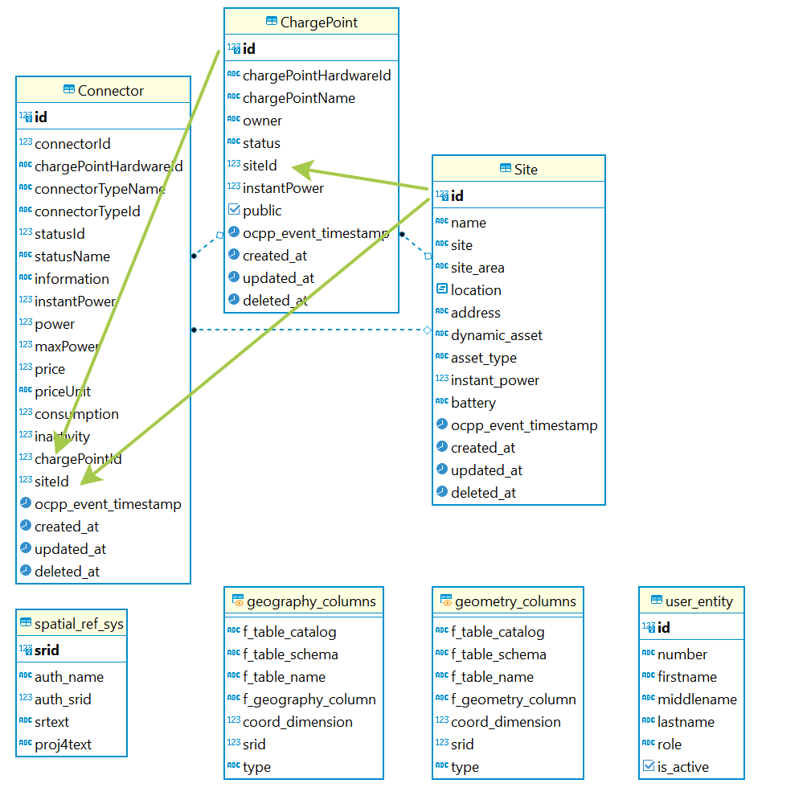

# NFT ART Generator Backend

## Описание

NFT ART Generator Backend создан для хранения, отдачи, фильтрации данных NFT ART Generator и генерации NFT картинок из слоев.

### Принцип работы

Backend просматривает blockchain NEAR в реальное время и отбирает вызовы функций контрактов указанных в конфигурации. Информация из отбранных функций сохраняется в собсвенную базу данных. Собственная БД копит информацию, дублируя данные из blockchain, сохраняя ее в максимально оптимальной структуре. Данные в БД записываются только из blockchain, для исключения искажения информации путем подделки запросов. Также backend может получать файлы от frontend для генерации рисунков коллекции. Фильтрация данных осуществляется с помощью запросов GraphQL.

### Стэк

В проекте использованы: Nestjs, TypeORM, PostgreSQL, Redis, WebSocket, Microservices, Near Lake Framework js, AWS, GraphQL, Docker, Docker-compose

### Проверка готовности среды выполниния

    sudo docker -v
    # output: Docker version 20.10.18, build b40c2f6
    # Версия должна быть больше >= 17.04

## Getting started

Для запуска приложения потребуется наличие установленной **Docker**
Скачайте репозиторий:

    git clone https://git.defispace.com/nft-near/api-near-indexer.git

Перейдите в папку репозитория:

    cd api-near-indexer

Скопируйте и переимнуйте файл конфигурации

    cp .env.example .env

Откройте файл .env и обязательно внесите свои данные в следующие строки:

    sudo nano .env

Файл .env

    ...
    DATABASE_PASSWORD="YOUR DATABASE PASSWORD"
    ...
    CONTRACT_ROOT_NFT="ROOT_CONTRACT_ACCOUNT_ID"
    CONTRACT_MARKET_NFT= "NFT_MARKET_CONTRACT_ACCOUNT_AD"
    ....
    AWS_ACCESS_KEY_ID= "YOUR AWS KEY ID"
    AWS_SECRET_ACCESS_KEY= "YOUR AWS ACCESS KEY"
    ...

Остальное можно поправить относительно вашей конфигурации сети и домена.

Запустите приложение командой:

    sudo docker-compose up -d

#### Дополнительно

Проверьте запущены ли контейнеры

    sudo docker ps

Output:

    ONTAINER ID   IMAGE                            COMMAND                  CREATED        STATUS         PORTS                                                                                            NAMES
    473075b69298   nft-art-publisher_backend        "yarn start"             34 hours ago   Up 34 hours    0.0.0.0:3011->3011/tcp, :::3011->3011/tcp                                                        nft-publisher-backend-prod
    e5208cde49e9   nft-art-publisher_lake           "npm run start:prod"     34 hours ago   Up 34 hours                                                                                                     near-lake-microservice-prod
    d8d7b1952666   postgres:alpine                  "docker-entrypoint.s…"   34 hours ago   Up 34 hours    0.0.0.0:5492->5432/tcp, :::5492->5432/tcp                                                        nft-publisher-database-prod
    a3c06facc302   redis:6.2-alpine                 "docker-entrypoint.s…"   34 hours ago   Up 34 hours    0.0.0.0:6380->6379/tcp, :::6380->6379/tcp                                                        redis-for-microservices-prod

Посмотрите логи контейнера c названием - ...backend...

    sudo docker logs nft-publisher-backend-prod

Output:

                Block #77064962

                Block #77064962

                Block #77064962

                Block #77064962

                Block #77064962

                Block #77064962

                Block #77064962

                Block #77064962

                Block #77064962

                Block #77064962

                Block #77064962

                Block #77064962

                Block #77064962

                Block #77064962
    outcome: []

                Block #77064963

Лог должен быть примерно таким

Остановить контейнеры можно команодой

    sudo docker-compose down

Если вы внесли изменения в файлы, то перезапускать стоит командой:

    sudo docker-compose up -d --build

### Запуск копии backend с использованием одного Near Lake Framework

Запустите те же команды, сто и при обычном запуске, но с другим настройками базы данных и backend в файле ./env.
**Внимание!** Первая копия репозитория уже должна быть запущена

    Скачайте репозиторий:
    git clone https://git.defispace.com/nft-near/api-near-indexer.git
    Перейдите в папку репозитория:
    cd api-near-indexer
    Скопируйте и переименуйте файл конфигурации
    sudo cp .env.example .env
    Откройте файл .env и обязательно внесите свои данные:
    sudo nano .env
    Запустите копию backend с отдельной базой данных командой:
    sudo docker-compose -f docker-compose.fork.yml up -d

Схема работы с fork:

**Но если**, вы запускаете для mainnet и testnet, то запустите две независымые копии включая Lake

Схема двух независимых копий:

### Запуск локально для разработки

Поправьте .env для локальной работы.
Запустите только только Redis и PostgreSQL контейнеры docker командой:

    sudo docker-compose -f docker-compose.db.yml up -d

Вы можете использовать установленные, либо установить Redis и PostgreSQL локально. если у вас не установлен Docker  
Далее можете запускать сервисы приложения отдельно переходя в соответсвующие папки:

Для near-lake-microservice:

    cd near-lake-microservice
    # скопировать и переименовать .env
     cp .env.example .env

    # внести изменения в конфигурацию
     sudo nano .env

    # установить пакеты
    sudo yarn

    # запустить сервис
    sudo yarn start

    # or for wath
    sudo yarn start:dev

Для backend:

    cd backend
    # скопировать и переименовать .env
     cp .env.example .env

    # внести изменения в конфигурацию
     sudo nano .env

    # установить пакеты
    sudo yarn

    # запустить сервис
    sudo yarn start

    # or for wath
    sudo yarn start:dev

### Схема базы данных

