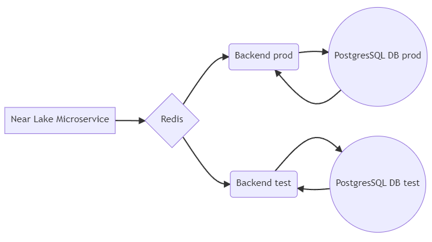
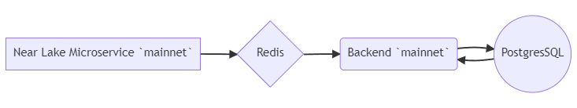
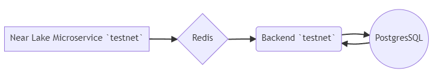
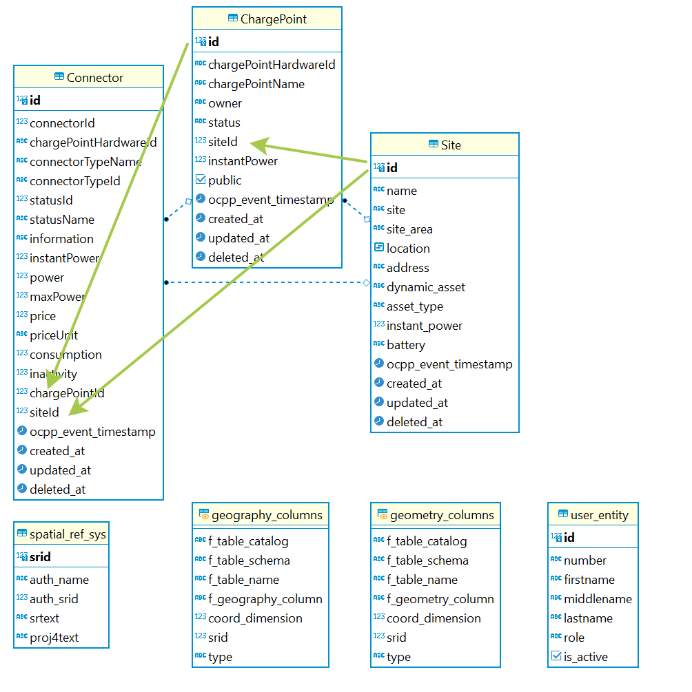

# NFT ART Generator Backend

## Description

NFT ART Generator Backend is designed to store, upload, filter NFT ART Generator data and generate NFT images from layers.

### Principle of operation

The backend scans the NEAR blockchain in real time and selects the function calls of the contracts specified in the configuration. Information from the selected functions is stored in its own database. Own database accumulates information, duplicating data from the blockchain, keeping it in the most optimal structure. The data in the database is recorded only from the blockchain, in order to exclude the distortion of information by forging requests. Also backend can receive files from frontend to generate collection drawings. Data filtering is done using GraphQL queries.

### Stack

Projects used: Nestjs, TypeORM, PostgreSQL, Redis, WebSocket, Microservices, Near Lake Framework js, AWS, GraphQL, Docker, Docker-compose

### Ready to work check

    sudo docker -v
    # output: Docker version 20.10.18, build b40c2f6
    # Version must be greater than >= 17.04

## Getting started

To run the application, you will need to have **Docker** installed

Download the repository:

    git clone https://git.defispace.com/nft-near/api-near-indexer.git

Go to the repository folder:

    cd api-near-indexer

Copy and rename the configuration file

    sudo cp .env.example .env

Open the .env file and be sure to enter your details in the possible lines:

    sudo nano .env

.env file

    ...
    DATABASE_PASSWORD="YOUR DATABASE PASSWORD"
    ...
    CONTRACT_ROOT_NFT="ROOT_CONTRACT_ACCOUNT_ID"
    CONTRACT_MARKET_NFT= "NFT_MARKET_CONTRACT_ACCOUNT_AD"
    ....
    AWS_ACCESS_KEY_ID= "YOUR AWS KEY ID"
    AWS_SECRET_ACCESS_KEY= "YOUR AWS ACCESS KEY"
    ...

The rest can be corrected relatively, regarding the creation of a list of networks and domains.

Run the application with the command:

    sudo docker-compose up -d

#### Optional

Are containers running

    sudo docker ps

Output:

    ONTAINER ID IMAGE COMMAND CREATED PORT NAME STATUS
    473075b69298 nft-art-publisher_backend "yarn start" 34 hours ago Up 34 hours 0.0.0.0:3011->3011/tcp, :::3011->3011/tcp nft-publisher-backend-prod
    e5208cde49e9 nft-art-publisher_lake "npm run start:prod" 34 hours ago Up 34 hours near lake-microservice-prod
    d8d7b1952666 postgres:alpine "docker-entrypoint.s…" 34 hours ago Up 34 hours 0.0.0.0:5492->5432/tcp, :::5492->5432/tcp nft-publisher-database-prod
    a3c06facc302 redis:6.2-alpine "docker-entrypoint.s…" 34 hours ago Up 34 hours 0.0.0.0:6380->6379/tcp, :::6380->6379/tcp redis-for-microservices-prod

Look at the container logs with name - ...backend...

    sudo docker registers nft-publisher-backend-prod

output:

                Block #77064962

                Block #77064962

                Block #77064962

                Block #77064962

                Block #77064962

                Block #77064962

                Block #77064962

                Block #77064962

                Block #77064962

                Block #77064962

                Block #77064962

                Block #77064962

                Block #77064962

                Block #77064962
    outcome: []

                Block #77064963

The log should be something like this

You can stop containers with the command

    sudo docker-compose down

If you have made changes to the files, then you should restart with the command:

    sudo docker-compose up -d --build

### Run a backend copy using one Near Lake Framework

Run the same commands on normal startup, but with different database and backend settings in ./env.
**Attention!** The first copy of the repository must already be running

    #Download the repository:
    git clone https://git.defispace.com/nft-near/api-near-indexer.git

    #Go to the repository folder:
    cd api-near-indexer

    #Copy and rename the configuration file
    sudo cp .env.example .env

    #Open the .env file and be sure to fill in your details:
    sudo nano .env

    #Start a backend copy with a separate database with the command:
    sudo docker-compose -f docker-compose.fork.yml up -d

Scheme of working with a fork:

**But if** you are running for mainnet and testnet then run two independent copies including Lake

Scheme of two independent copies:

### Run locally for development

Fix .env for local work.
Start only Redis and PostgreSQL docker containers with the command:

    sudo docker-compose -f docker-compose.db.yml up -d

You can use the installed ones or install Redis and PostgreSQL locally. if you don't have Docker installed
Then you can start the application services separately by going to the corresponding folders:

For near-lake-microservice:

    cd near-lake-microservice
    # copy and rename .env
     cp .env.example .env

    # make changes to the configuration
     sudo nano .env

    # install packages
    sudo yarn

    # start the service
    sudo yarn start

    # or for watch
    sudo yarn start:dev

For backend:

    cd backend
    # copy and rename .env
     cp .env.example .env

    # make changes to the configuration
     sudo nano .env

    # install packages
    sudo yarn

    # start the service
    sudo yarn start

    # or for watch
    sudo yarn start:dev

### Database schema

